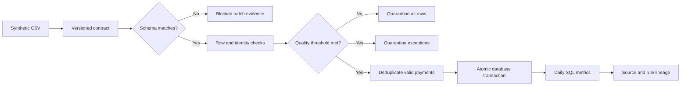

# Governed Data Product Pipeline

A runnable reference pipeline that turns synthetic claims-payment CSV files into a governed daily data product.

**Status: local MVP.** Implemented with Python and SQLite. PostgreSQL, dbt and cloud deployment are planned extensions, not current capabilities. No customer or production data is included.

## What it demonstrates

- **Versioned contract:** exact column order, supported version, synthetic policy references, currency values, amount bounds and a batch quality threshold.
- **Quality gates:** malformed schemas block the entire batch; invalid records are quarantined with reason codes.
- **Atomic publication:** accepted records, batch decisions and lineage observations commit together.
- **Replay safety:** the same source, contract and transformation produce the same batch identity. Repeated payment IDs are deduplicated; conflicting values never silently overwrite published records.
- **Traceability:** a metric can be traced to contributor IDs, source records, source checksums, contract snapshots and transformation checksums.
- **Reviewable evidence:** JSON exports contain batch outcomes, daily metrics and quarantined records.

The example product answers: **How many synthetic claim payments were made each day, and what was the total in each currency?** Currency totals remain separate. Amounts are stored as integer minor units.

## Quick start

Requires Python 3.11+ with SQLite support. There are no third-party runtime dependencies. Run from this repository's root.

```bash
python -m pipeline run data/synthetic-payments.csv
python -m pipeline report --output work/evidence.json
python -m pipeline trace 2026-01-15 EUR
python -m unittest discover -s tests -v
```

If your Windows installation uses the launcher, replace `python` with `py -3`.

Expected first-run outcome on an empty database: **12 records → 10 published + 2 quarantined**, with **550,000 EUR cents (EUR 5,500.00)** across 10 payments. The two exceptions have an invalid amount and an unsupported currency.

Run the same input again:

```bash
python -m pipeline run data/synthetic-payments.csv
```

The response reports `replayed: true`; the number of published payments stays 10. Its inserted/duplicate counts describe the original batch decision, not newly inserted rows during replay.

[Five-minute walkthrough](docs/walkthrough.md) · [Architecture](docs/architecture.md) · [Validation record](docs/validation.md)

## Flow



## Contract and semantics

The contract is [claims-payments.v1.json](contracts/claims-payments.v1.json). It names accountable roles rather than real people. The reference policy list is deliberately small and synthetic.

A batch is blocked when its invalid-row fraction is **greater than 25%**. At or below that threshold, valid rows publish and invalid rows are quarantined. The threshold is illustrative, not an industry standard. A blocked batch publishes no payments; otherwise valid rows receive `BATCH_QUALITY_GATE` in quarantine.

Payment identity is append-only. An identical payment in another batch is recorded as a duplicate observation. A changed value for an existing payment is quarantined, not treated as an update. Remediation of already published payments needs a future explicit correction/reversal design.

An exact replay is identified by source bytes + canonical contract + transformation checksum. File names are not identity. Reprocessing after a contract/code change is a distinct batch, but unchanged payment IDs still deduplicate. Existing published payments are not retroactively revalidated.

Schema failures retain the original source bytes at batch level. Row numbers refer to one-based CSV **record positions including the header**, not physical lines when quoted multiline fields occur. The source hash allows retrieval of the exact archived CSV in the database.

## Repository map

| Path | Purpose |
|---|---|
| `contracts/` | Versioned product contract |
| `data/synthetic-payments.csv` | Reproducible synthetic input |
| `pipeline/core.py` | Contract checks, ingestion and evidence |
| `pipeline/schema.sql` | Persistent batch, payment, observation and quarantine tables |
| `pipeline/metrics.sql` | Daily aggregates by currency |
| `tests/` | Behavioral tests including concurrency and transaction rollback |
| `examples/` | Evidence captured from the sample run |
| `docs/adr/` | Storage, orchestration and enforcement decisions |
| `.github/workflows/` | CI configuration for Python 3.11–3.13 |

## Operational behavior

- Exit `0`: successful publication, replay, generation or report.
- Exit `2`: batch blocked by schema or quality controls; evidence retained.
- Exit `1`: invalid configuration or file operation. Unexpected storage/runtime errors also fail the process.
- Local execution is limited to 10 MB and 10,000 records per batch.
- SQLite serializes writers using an explicit immediate transaction with a 15-second busy timeout.
- Runtime/database errors roll back the batch. They do not leave a persisted success or partial publication. The caller must collect failed-process logs.
- Source files and evidence can contain input values. This demonstration must only be fed synthetic data.

## Limits and next increments

This is not a production platform or an AI model. It demonstrates governed data preparation that could feed analytics or AI applications.

There is no authentication, external scheduler, schema migration engine, row-level authorization, automated retention, remote source connector or immutable evidence store. Checksums help identify content; someone with database write access can change both data and hashes. The source/contract snapshots and version-controlled code support inspection, not a claim of tamper-proof assurance.

Next: PostgreSQL migration and dbt models; workload benchmarks; explicitly governed corrections; a cloud deployment with managed identity and tested recovery. See [cloud design](docs/cloud-design.md). No cloud resources are deployed.

## Data and privacy

All fixture IDs and amounts are generated for this project. No private career information, employer/client names or personal contact details are required. Runtime files live under ignored `work/`.

No license has been selected yet.

